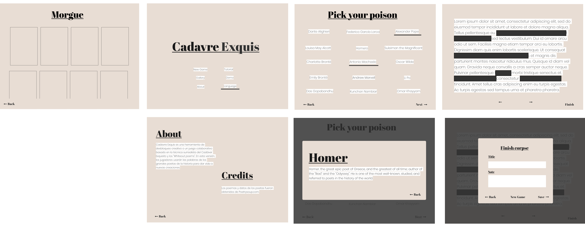

# Cadavre Exquis

Both a tool to help with the dreaded artist block and a collaborative game based on the surrealist technique of the **Exquisite Corpse** and **Whiteout Poems**. In this version of the game, the players will use the words from the world greatest to give life to new creations.



## Installation

To install, dowload the source file into your computer and on your terminal type

``` bash
pip install cadavre_exquis
```

## Features

- Select up to 4 poets to use the words of their most famous poems
- Explore the lives of each poet
- Save your creations and create your own collection
- English and spanish support *(coming soon)*

## License & Credits

- **License:** GNU General Public License v3
- **Documentation:** <https://drearondov.github.io/poetas_exquisitos>

This package was created with
[Cookiecutter](https://github.com/audreyr/cookiecutter) and the
[wboxx1/cookiecutter-pypackage-poetry](https://github.com/wboxx1/cookiecutter-pypackage-poetry)
project template.

Data on the poets and poems can be found at [Poetry Soup](https://www.poetrysoup.com)
